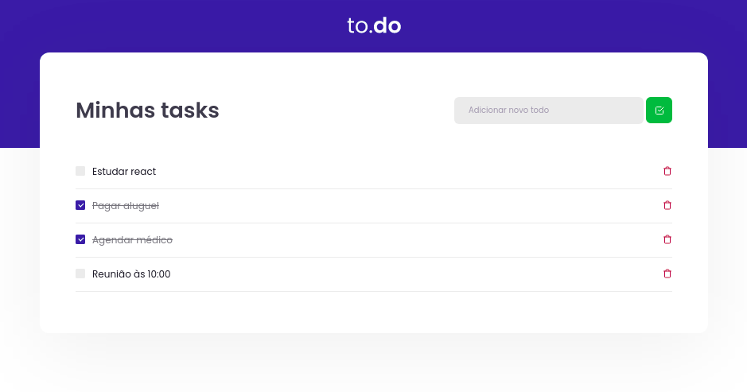

# to.do
Aplicação para listar as atividades a serem feitas. Desafio Ignite | [Rocketseat](https://rocketseat.com.br/) :rocket:

### Instalação
Utilize do gerenciador de pacotes, **yarn**, para instalar todas as dependências:

`yarn install`

### Uso
Para verificar os testes, execute: 

`yarn test`

Para executar a aplicação:

`yarn dev`

---
###### [Instruções do desafio](https://www.notion.so/Desafio-01-Conceitos-do-React-51e4099a6e2f4d4bae94f9fe75bb769d)
